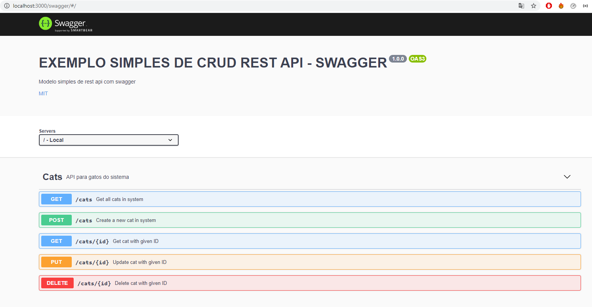
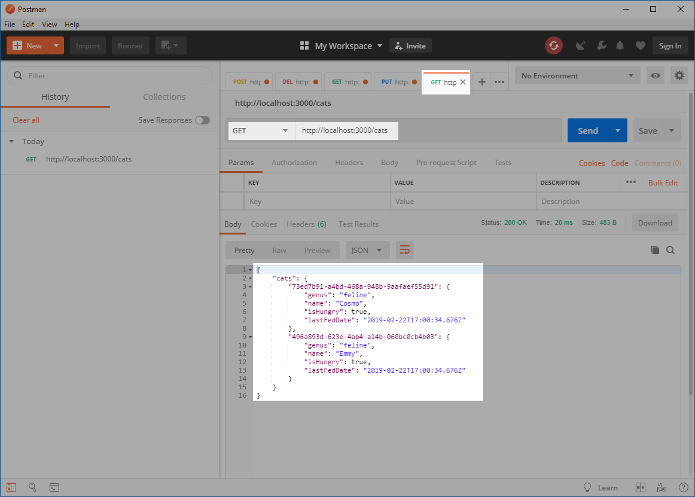
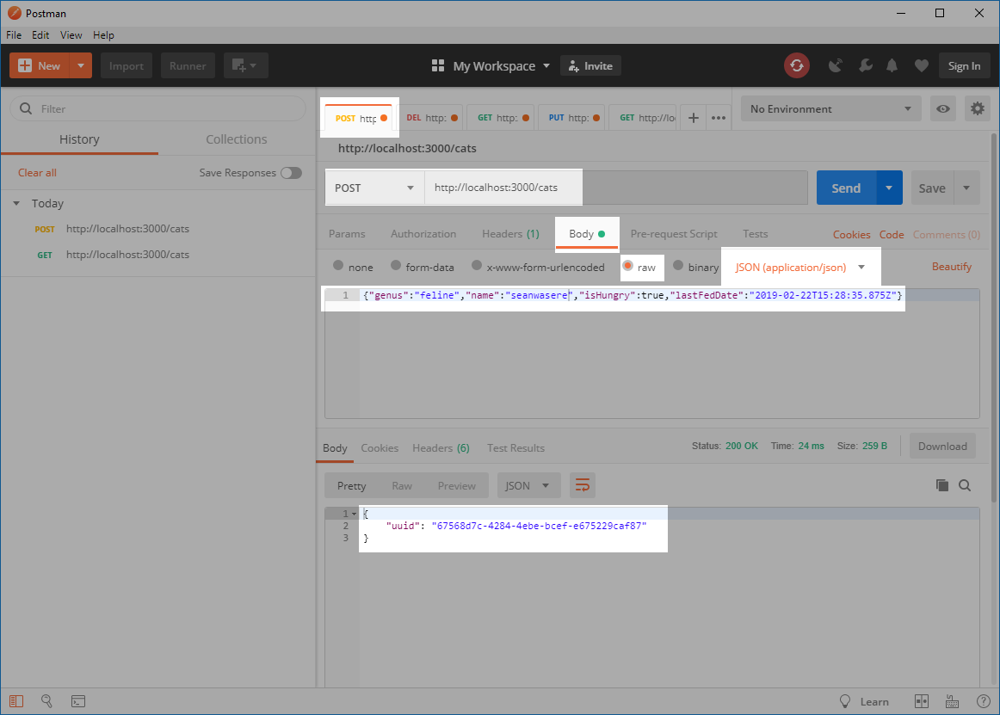
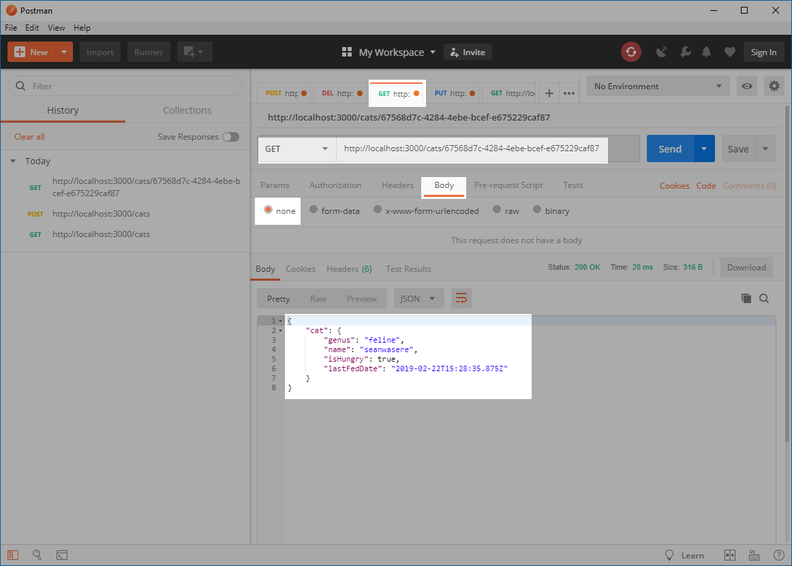
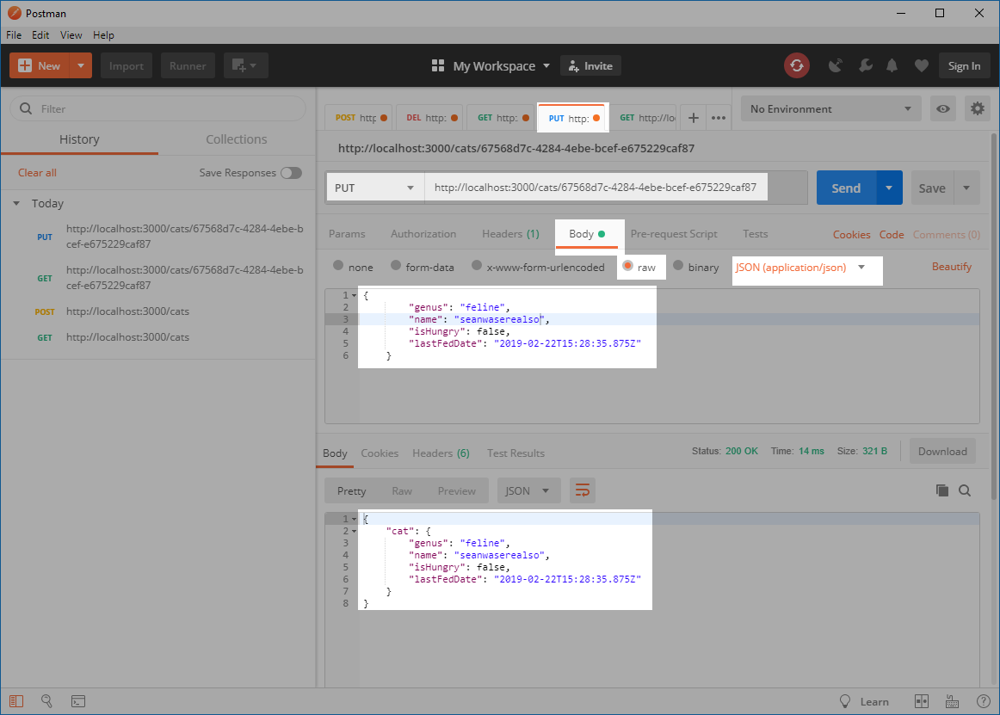
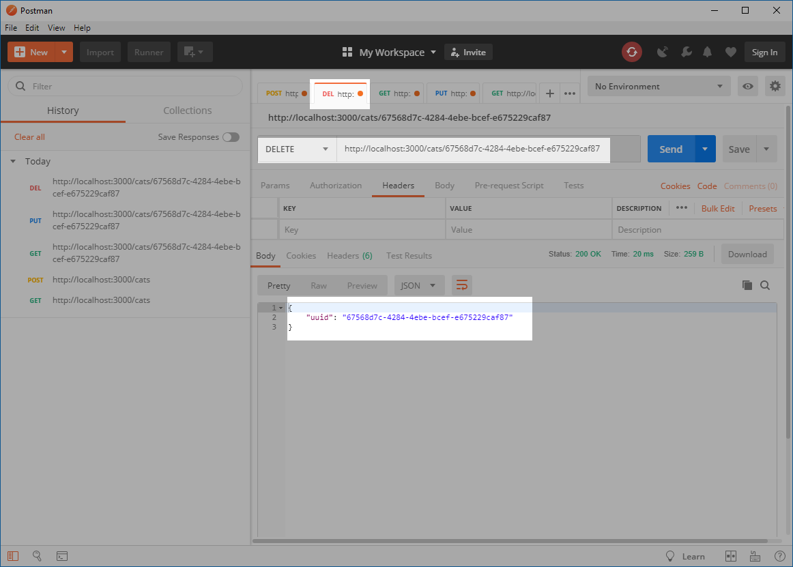

  

## REST_API_SWAGGER

  

### Setup

  

  

```bash

  

npm install

  

```

  

  

### Iniciar como desenvolvimento com nodemon e tsc --watch

  

  

```bash

  

npm run dev

  

```

  

  

Após iniciar acesse: `http://localhost:3000/cats`

  

  

### Iniciar sem o nodemon e tsc --watch

  

  

```bash

  

npm start

  

```

  

  

Após iniciar acesse: `http://localhost:3000/cats`

  

  

## Swagger

  

  

Acesse: `http://localhost:3000/swagger` para visializar a documentação atraves do Swagger-UI

  



  

  
  
  

## Modo de usar exemplo

  

  

### (Get) Lista todos os dados

  



  

  

### (Post)  Cria um novo dado

  



  

  

### (Get) Busca um novo dado através do id

  



  

  

### (Put) Atualiza dado através do id

  



  

  

### (Delete) Remove dado atraves do id

  

